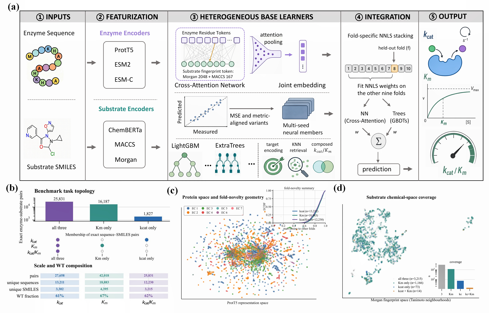

# EnzyRank

**A systematic framework for enzyme kinetic parameter prediction (kcat, Km, kcat/Km) — state of the
art under fair comparison.**

EnzyRank predicts the three central enzyme kinetic parameters — turnover number **kcat**, Michaelis
constant **Km**, and catalytic efficiency **kcat/Km** — from an enzyme amino-acid sequence and a
substrate SMILES string. On the **CataPro** benchmark (Nat. Commun. 2025), under an identical
minimum-fair-comparison protocol (same data, same 0.4-similarity 10-fold split, same metrics),
EnzyRank **beats the CataPro state of the art on all 9 metric × parameter cells** (PCC, SCC, RMSE for
each of kcat, Km, kcat/Km).

EnzyRank is a **system**: it systematically combines multi-protein-language-model representations,
two complementary predictor families (a cross-attention neural network and gradient-boosted trees),
and a metric-aligned training objective, integrated by heterogeneous stacking. Its contributions are:

1. **Fair-comparison state of the art** — 9/9 metric×parameter cells over CataPro under an identical
   protocol (robust to the aggregation convention).
2. **Metric-aligned training** — to our knowledge the first application of correlation-aligned losses
   to enzyme kinetics: a differentiable Pearson (+ soft-Spearman) term augmenting MSE, so the network
   optimises the scored metric. Effect size: modest at the single-model level (see below).
3. **An ablation-backed finding** that different model families are complementary across kinetic
   parameters (tree models carry kcat/Km, the correlation network carries kcat·Km⁻¹), so the
   systematic combination outperforms any single model.

EnzyRank is an independent successor to *EnzyStack* (v1) and reuses v1's out-of-fold predictions as
frozen ensemble members. The controlled ablation supporting these claims is in a separate study,
`../EnzyRank_ablation/`.

## Model overview



*Figure 1. EnzyRank model architecture and evaluation design.*

## Method

EnzyRank is built from complementary components, integrated by a stack. It featurises each enzyme
with **multiple frozen protein language models** (ProtT5, ESM2-650M, and the generational **ESM-C
600M**) and each substrate with ChemBERTa plus MACCS/Morgan fingerprints. Two complementary predictor
families consume these features:

1. **Cross-attention neural network** — enzyme residues attend to the substrate (and vice versa),
   with attention pooling to a joint representation (`src/models/`).
2. **Gradient-boosted / extra-trees regressors** on pooled features (`src/models/gbdt_model.py`).

The controlled ablation (`../EnzyRank_ablation/`) shows these families are **complementary across
parameters** — the tree family carries kcat/Km, the correlation network carries kcat·Km⁻¹ — so the
**systematic combination outperforms any single model** (this, not any single component, is what wins).

The **novel methodological element** is how the neural network is trained:

- **Metric-aligned training (`src/training/losses.py`).** The benchmark scores Pearson/Spearman
  correlation, which MSE does not directly optimise. EnzyRank **augments MSE** with a differentiable
  **Pearson (+ small soft-Spearman)** term and selects checkpoints by validation PCC, aligning
  training with the scored metric. The ablation clarifies the controlled picture: this is an
  *augmentation of* MSE, **not a replacement** — the MSE anchor is essential (it keeps predictions
  scale-consistent across folds), **Pearson is the useful correlation term**, and Spearman-alone
  underperforms MSE. The effect is measurable but **modest** at the single-model level (+0.008–0.012 PCC on
  kcat/Km; within single-seed noise on the noisier kcat·Km⁻¹), and is amplified by seed-ensembling and
  stacking. To our knowledge it is the first application of correlation-aligned training to enzyme
  kinetics.

The system is completed by standard, well-executed machinery (described here as *how it is built*, not
as novelty): **seed ensembling** of the network; **multi-PLM diversity** — ESM-C 600M (a generational
LM, weaker alone but additive as a stack member; loaded from local HF weights remapped into the `esm`
SDK, no download, `src/features/protein_esmc.py`); **fold-safe retrieval** added only to Km; and
**heterogeneous stacking** combining everything. Evaluation is leakage-free per fold — a correctness
requirement, not a contribution.

Limitations and negative results are reported in `docs/RESULTS.md`, `EXPERIMENTS.md` and the ablation: single-component
gains are modest and the advantage comes from the combination; multi-task + physical consistency was
negligible; retrieval does not help kcat/kcat_km; ESM-C does not help Km; Km did not reach the +3%
target. The full ranked innovation plan is in `docs/INNOVATION_RANKING.md`.

## Installation

```bash
conda env create -f environment.yml
conda activate enzyrank
```

Tested on Ubuntu, NVIDIA RTX 5090 (CUDA 12.8, PyTorch 2.8). The environment is the only thing you
build from the manifest; everything else needed to reproduce is in this repository.

## Getting the data and models

- **Data** — the CataPro benchmark CSVs (with the official folds) are **bundled** under
  `data/catapro_benchmark/`. See `data/README.md` for the split and target/unit conventions.
- **Models** — ChemBERTa (14 MB) is **bundled** under `pretrained/`. The three large encoders
  (ProtT5, ESM2-650M, ESM-C 600M; each ~2–2.5 GB) are downloaded from Hugging Face and placed under
  `pretrained/`. See `pretrained/README.md` for exact links and the required directory layout. The
  large encoders are **not** needed to reproduce the headline table (see below) — only to regenerate
  feature caches / retrain from scratch.

### Optional precomputed feature cache

To skip feature extraction, download `cache.tar.gz` to the repository root and extract it there. The
archive creates the complete `cache/` directory, including the pooled and per-residue HDF5 features
and the small substrate/ChemBERTa NPZ caches.

**Google Drive archive:** [Download `cache.tar.gz`](https://drive.google.com/file/d/19EGo5V4qqzF35-4WNcCZuykS7tCorISA/view?usp=sharing)

```bash
tar -xzf cache.tar.gz
```

After extraction, `EnzyRank/cache/esmc_residue.h5` should exist. On Windows, 7-Zip can extract the
same archive; keep the resulting `cache` directory at the repository root.

The HDF5 files remain excluded from Git because they are regenerable and exceed normal Git hosting
limits. The small NPZ caches are also included in the Git repository, so downloading this archive is
optional for the instant Tier 1 reproduction below.

## Reproduce

**Tier 1 — reproduce the headline table instantly (no downloads, seconds).**
The out-of-fold predictions of every ensemble member are shipped (`results/oof/`,
`baseline_v1_oof/`), so the exact 9/9 table is regenerated from them:

```bash
python scripts/final_report.py        # prints the table; also saved to results/final_table.txt
```

**Tier 2 — retrain everything from features.**
Requires the pretrained encoders (`pretrained/README.md`). The HDF5 feature caches (pooled and
per-residue embeddings) are regenerated from those encoders via `scripts/extract_*.py`; they are
kept on disk locally but excluded from git (too large for GitHub). One command runs ESM-C
extraction, all base members, and the final stack:

```bash
bash reproduce.sh
```

## Repository layout

```
EnzyRank/
├── README.md · EXPERIMENTS.md · PLAN.md · environment.yml · reproduce.sh
├── configs/ensemble.yaml         # optimal per-parameter stack members
├── data/                         # bundled CataPro benchmark CSVs + folds (see data/README.md)
├── pretrained/                   # ChemBERTa bundled; large encoders downloaded (pretrained/README.md)
├── baseline_v1_oof/              # inherited v1 (EnzyStack) out-of-fold predictions — frozen members
├── results/oof/                  # EnzyRank out-of-fold predictions; results/final_table.txt
├── cache/                        # HDF5 feature caches — regenerable (git-excluded); small .npz tracked
├── src/                          # library: data, features, models, training, eval, paths
├── scripts/                      # run_experiment (NN), run_gbdt, extract_*, final_report, ...
└── docs/                         # INNOVATION_RANKING, RESULTS, AUTONOMOUS_PLAN
```

Large, fully-regenerable artifacts (the HDF5 feature caches, the downloaded encoders) are kept on
disk for local use but excluded from git via `.gitignore`, so the repository stays deployable while
`data/`, all out-of-fold predictions, configs, code, docs, the small `.npz` caches, and the bundled
ChemBERTa model are tracked. A fresh clone reproduces the headline table (Tier 1) with no large files.

## Citation

If you use EnzyRank, please cite this repository and the CataPro benchmark
(Han et al., *Nature Communications*, 2025) whose data and evaluation protocol we adopt.

## License

MIT — see `LICENSE`.
